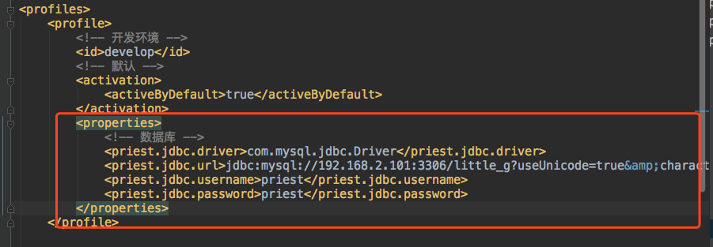
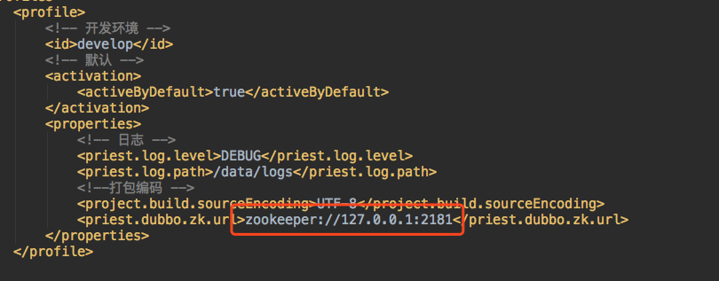
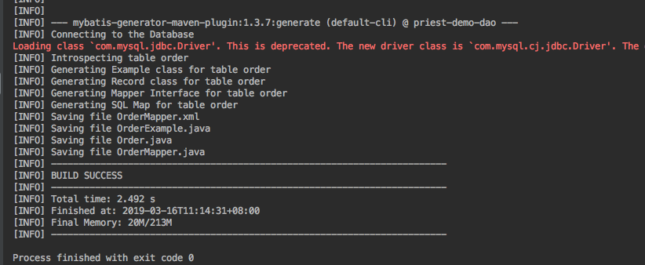

# priest
 dubbo mybatis springboot base soa rest api framework with customer code generator


## 前言


   `priest`项目是一个以 **incubator-dubbo** - **Spring Boot** - **Mybatis3** 为基础的SOA开源开发框架
   
## 项目介绍
   
   `priest`项目基于springboot+dubbo+mybatis的分布式敏捷开发框架，将 **JSR303** **hibernate-validate** 验证体系完美融合**dubbo**服务框架。并以此为基础开发了maven-code-generator 插件，让研发人员从重复的增删改查工作中彻底解脱。
 
   本项目为后续开源的所有项目的基石项目，后续计划陆续的开源项目将会有 **用户中心**  **支付中心** 敬请期待！
   
   **文档陆续补充中**
   

### 组织结构


```lua

├── dubbo   --dubbo 打包部署相关配置及启动脚本
│   ├── assembly
│   └── bin
├── dubbo-extend  --dubbo 扩展支持dubbo接口参数校验
├── plugin-test   --maven plugin 测试项目
├── priest-common --priest 项目公用模块
├── priest-common-web --priest 项目共用web服务
├── priest-demo 	 --priest 服务化样例项目
│   ├── priest-demo-api 	--priest 服务化样例api项目
│   ├── priest-demo-dao 	--priest 服务化样例dao项目
│   ├── priest-demo-http 	--priest 服务化样例http项目
│   └── priest-demo-service  --priest 服务化样例dubbo服务项目
└── priest-generator  --priest 代码生成插件项目
  
```

## Getting Started

-------

### 项目依赖
1. mysql 数据库
2. zookeeper 注册服务
3. maven
4. jdk 1.8+

### 项目编译

1. 进入项目根目录
2. 打开项目 priest-demo/priest-demo-dao/src/main/resources/demo.sql 建立创建测试数据库及表
3. 修改 priest-demo/priest-demo-dao/pom.xml develop profile 关于jdbc的配置见下图
	
	
	
4. 修改 根目录pom.xml develop profile 关于zookeeper配置见下图  
	 
	
5. 进入项目根目录
6. `mvn clean install -Pdevelop`

### 项目运行

1. dubbo service 启动

 运行  `priest-demo/priest-demo-service/src/test/java/com/little/g/demo/TestDubbo.java main`
 
2. http 启动
	
   * 进入priest-demo/priest-demo-http 项目目录 
   * 执行 `mvn spring-boot:run`  ，观察控制台日志输出，出现如下日志，便是启动成功了。

	 

3. 接口访问测试

  `curl http://127.0.0.1:8888/user/test`


### 开发流程

#### 数据库建表
本例以order表为例子建表语句如下:

```sql
	
CREATE TABLE `order` (
  `id` int(11) unsigned NOT NULL AUTO_INCREMENT,
  `uid` int(11) DEFAULT NULL COMMENT '用户ID',
  `money` bigint(15) DEFAULT NULL COMMENT '金额',
  `create_time` bigint(15) DEFAULT NULL COMMENT '创建时间',
  `status` tinyint(4) DEFAULT NULL COMMENT '状态',
  PRIMARY KEY (`id`)
) ENGINE=InnoDB DEFAULT CHARSET=utf8mb4 COLLATE=utf8mb4_unicode_ci;
	
```


#### dao 生成

1. 打开priest-demo/priest-demo-dao/src/test/resources/generatorConfig.xml追加如下配置

```
<table tableName="order" delimitIdentifiers="true" >
            <generatedKey column="id"  sqlStatement="JDBC" />
</table>     
```

2.  调用priest-demo-dao的 mybatis-generator插件的  mybatis-generator:generate 任务,执行结果如下:
 

3. 关于mybatis-generator的详细配置和文档可参见 [MyBatis Generator](http://www.mybatis.org/generator/index.html)

#### api 生成

1. 拷贝 `com.little.g.demo.model.Order` 至 priest-demo-api 项目的 `com.little.g.demo.api.dto` 重命名为 OrderDTO
2. 打开priest-demo/priest-demo-api/src/main/conf/GenerateConfig.xml 追加如下配置

```
<generateFile packagePath="/com/little/g/demo/api" templateName="Service.tpl" fileName="OrderService.java">
        <property name="entityName" value="Order" />
</generateFile>

```

3.  调用priest-demo-api的 generator插件的 generator:generate 任务,执行结果如下:
 

4. 关于generator 插件的详细配置和文档可参见

#### service 生成

1. 打开priest-demo/priest-demo-service/src/main/conf/GenerateConfig.xml 追加如下配置

```
<generateFile packagePath="/com/little/g/demo/service" templateName="ServiceImpl.tpl" fileName="OrderServiceImpl.java">
        <property name="entityName" value="Order" />
</generateFile>

```

2.  调用priest-demo-service的 generator插件的 generator:generate 任务,执行结果如下:
 

3. priest-demo-service dubbo-config.xml 追加dubbo service 接口暴露

	`<dubbo:service interface="com.little.g.demo.api.OrderService" ref="orderService"/>`

4. 关于generator 插件的详细配置和文档可参见 [priest generator](https://github.com/G-little/priest/tree/master/priest-generator)


#### http 生成

1. 打开priest-demo/priest-demo-http/src/main/conf/GenerateConfig.xml 追加如下配置

```
<generateFile packagePath="/com/little/g/demo/web" templateName="Controller.tpl" fileName="OrderController.java">
        <property name="entityName" value="Order" />
</generateFile>

```

2.  调用priest-demo-http的 generator插件的 generator:generate 任务,执行结果如下:
 

3. priest-demo-http dubbo-consume.xml 追加dubbo service 引用

	`<dubbo:reference id="orderService" interface="com.little.g.demo.api.OrderService" />`

4. 关于generator 插件的详细配置和文档可参见 [priest generator](https://github.com/G-little/priest/tree/master/priest-generator)


#### 批量生成脚本

您也可以在配置完成后，直接执行批量生成脚本，完成上述所有步骤
脚本位于 priest-demo 根目录

```shell

	sh	code_generate.sh
	
```

#### 最后项目重新编译运行，新开发的接口就可以测试了


   

 
 


